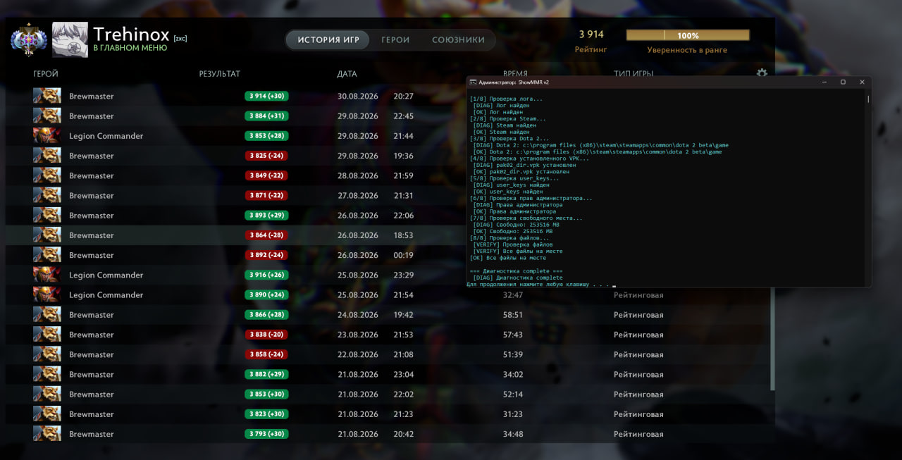

# ShowMMR v2 Dota 2 MMR Dashboard Mod

by [t.me/xanoya](https://t.me/xanoya) | 2026-08-30




Модификация для отображения MMR в истории матчей Dota 2. После установки в профиле появляется колонка **Result** с рейтингом (например, `5432 (+25)`).

## 🚀 Установка
1. **Запустите установщик от имени администратора:**
   - `ShowMMR_ru.bat` — русская версия
   - `ShowMMR_en.bat` или `dasasd.bat` — английская версия
   
   > **Важно:** ПКМ → *Запуск от имени администратора*

2. **В меню выберите:** `1 Установить`
   
Мод скопируется в:

Steam\steamapps\common\dota 2 beta\game\dota_mods\pak02_dir.vpk

3. **Уберите `-nojoy` из параметров запуска Dota 2**

Мод использует слоты `JOY1-JOY32` для хранения истории матчей.

4. **Перезапустите Dota 2**

Профиль → История матчей → колонка **Result** с MMR.

## 🛠 Сборка

| Команда | Описание |
|---------|----------|
| `6 Собрать VPK` | Компилирует `source\` в `pak02_dir.vpk` через `build_vpk.bat` (требуется `resourcecompiler`). Если отсутствует — используется готовый `pak02_dir.vpk` (сборка 30429). |
| `5 Обновить MMR` | Запускает `ShowMMR_tool\bin\Release\net48\ShowMMR.exe`. Кеш `*.auth` хранится рядом с инструментом, `user_keys\` создаётся автоматически. |

## 📁 Структура проекта

```
├── source\ # Исходники панорамы/Lua (13 файлов)
├── ShowMMR_tool\ # C# SteamKit2 утилита
│ ├── Program.cs
│ ├── *.csproj
│ └── bin\Release\net48\ShowMMR.exe
├── ShowMMR_en.bat # EN-инсталлятор (UTF-8)
├── ShowMMR_ru.bat # RU-инсталлятор (CP866)
├── pak02_dir.vpk # Собранный мод (сборка 30429)
└── user_keys\ # Автоматически создаётся: user_keys__slot3.vcfg
```

### 🔍 Путь файлов

```
                         _______________________
                         | scripts /            |  3  | GetTableValue |
                         | custom_net_tables.txt|_____|_______________|
                         |  __>___>___>__       |     |  panorama /    |
                         |^|             |      |     |  scripts /     |
                   ______| |_____        |      |     |  showmmr/      |
   C# ShowMMR_tool |             2|      |      |     |  data.js       |
   SteamKit2 GC -> | scripts /    |______|______|_____|  logic.js      | 4
   user_keys_%d_   | vscripts /   |      SendCustomGameEvent            | panorama / layout /
   slot3.vcfg  1   | core /       |_____________________________________| base.xml
    _______________| coreinit.lua |      |     DOTARankUpdated          | dashboard_page_
   |               |______________|      |     DOTAShowLocalProfile..   | profile_hero_stats.xml
   |  LoadKeyValues |     |              |     #ranked_mmr_value        |_______________|
   |_______________>|_____|___________   |_______________    |__________|      | 5
                          |           6  | panorama /     |  |  core.Data.history
                          |  panorama /  | images /       |__|__________________|
                          |  layout /    | background.png |
                          |______________|________________|
```

`1` `cfg/user_keys_%d_slot3.vcfg` в†’ `LoadKeyValues` в†’ `2 coreinit.lua` в†’ `SetTableValue` в†’ `3 custom_net_tables.txt` в†’ `4 panorama/layout` в†’ `5 dashboard` + `6 panorama/images`

**Меню → `8 Диагностика`** проверяет:

- `SteamPath` (реестр `HKCU\Software\Valve\Steam`)
- `DOTA_PATH`
- Наличие `dota_mods`
- Права администратора
- Свободное место на диске

Лог пишется в `showmmr_log.txt` с ротацией до **10 МБ**.

---

## ⚙️ Требования

- **ОС:** Windows 10/11
- **Платформа:** Steam + Dota 2
- **Права:** Администратор (для установки мода)

---

## ⚠️ Отказ от ответственности

Используйте на свой страх и риск. Valve исторически не выдавала баны за дашборд-модификации, но официальной поддержки нет.

---

## 📬 Контакты

- Telegram: [@xanoya](https://t.me/xanoya)
- Дата релиза: 2026-08-30
